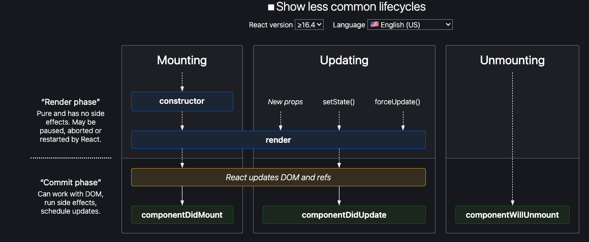

# Complete React Developer in 2023 (w/ Redux, Hooks, GraphQL)
### come back to section 2 after finishing course

- declarative
  - set state and react updates
  - less expensive than dom manipulation
  - creates virtualDOM, or js dom

- unidirectional data flow
  - when state changes, the dom passes that information down
  - state cannot pass information up dom
  - makes it easier to debug code
    - go to where state/component changes

- npx
  - package inside npm
  - downloads latest package, runs immediately, and deletes

- manifest.json
  - allows for downloading progressive web app
  - use on desktop instead of browser

- classes vs hooks
  - hooks are react specific, newer
  - classes are ubiquitious, older

- updating real dom is expensive
  - react duplicates real dom with js (virtual dom)
  - reflow - faster
  - batches set state if they are slow/fast enough to do them all at once
  - real dom goes through reflow, updates only what has changed

## SPA
  - pre 2010, needed to communicate with server for every page switch
  - with react, all of the pages are in the code, no need to go to the server for every page change

## Array Methods
  - .map is more efficient than a for loop, and gives you a new array back

  ```
  const myArray = [1, 2, 3, 4]
  myArray.map(element => element + 1)
  ```
  returns [2, 3, 4, 5]

  - .filter
    - returns new array
    - returns true/false

  ```
  const myArray = [1, 3, 5, 7, 9]
  myArray.filter(el => el > 4)
  ```

  - .includes
    - takes single argument
    - checks inside array to see if argument exists
  ```
  const myArray = [1, 2, 3, 4, ]
  myArray.includes(3)
  myArray.includes
  ```


- functional components dont directly interact with phases
  - no calling constructor or render
  - pure functions, whatever is returned is UI
  - lifestyle not like class components
- pure vs impure functions
  - pure:
    - returns same things when given the same argument, no matter how many times it is called
    ``` const pureFunc = (a, b) => a + b ```
    - should not profuct side effects
      - when a function creates changes outside of scope of the function, ie setting a global variable inside of a function
  - impure:
    - returns different things
    - produces side effects
    - hooks produce side effects
